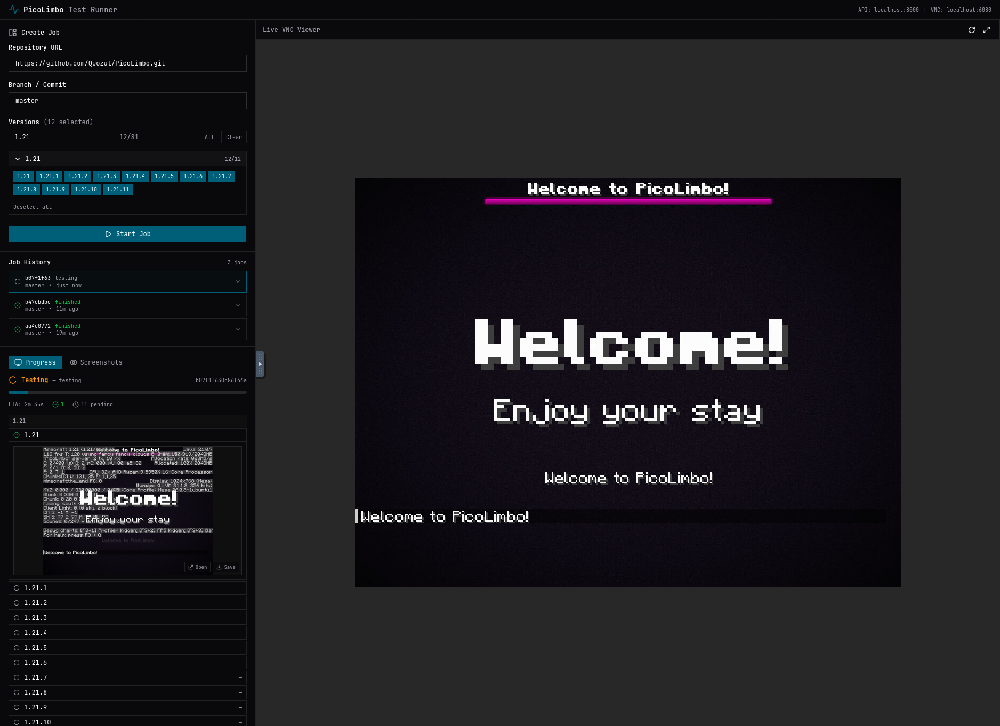

<div align="center">

# PicoLimbo Integration Tests

**A Docker-based test harness for verifying [PicoLimbo](https://github.com/Quozul/PicoLimbo) against real Minecraft clients**

*Supporting 81 Minecraft versions from 1.7.2 through 26.1.2*

[](https://www.docker.com/)
[](https://www.python.org/)

[💬 Join the conversation](https://discord.gg/M2a9dxJPRy) • [📖 PicoLimbo](https://github.com/Quozul/PicoLimbo)

</div>

---

## Introduction

PicoLimbo is an ultra-lightweight, multi-version Minecraft limbo server written in Rust. This sidecar project was built specifically to test PicoLimbo against **real Minecraft clients** across dozens of versions.

It builds PicoLimbo from source, launches the server, runs Minecraft clients for each requested version inside a virtual desktop, and captures screenshots confirming successful connections. The entire system runs inside a single Docker container with a virtual display, making it suitable for CI/CD pipelines or headless environments.

---

## Features

### 🏗️ Automated Build Pipeline

Clones the PicoLimbo repository, builds the Rust binary, and caches artifacts. Supports specifying a branch name or commit hash.

### 🎮 Multi-Version Client Testing

Launches real Minecraft clients for each requested version — from **1.7.2 to 26.1.2** — connecting them all to the same PicoLimbo server instance.

### 📸 Screenshot Verification

Each client's screen is captured via virtual display (Xvfb/Xorg). Screen region matching against reference images confirms the game is fully loaded before disconnecting.

### 🖥️ Embedded Web UI

A React-based dashboard is embedded in the Docker image, served at port 8000, providing a three-column layout for job creation, VNC viewing, and job history.

### 📡 REST API

A FastAPI backend exposes endpoints for creating jobs, monitoring progress, and downloading artifacts — all consumable via curl or any HTTP client.

---

## Quick Start

### Prerequisites

- [Docker](https://www.docker.com/) and [Docker Compose](https://docs.docker.com/compose/)
- A machine with at least 2 GB of RAM (more if testing many versions concurrently)

### Running the Project

```shell
# Build and start the container in detached mode
docker compose up --build -d

# Check the API is running
curl http://localhost:8000/health
```

### Creating a Test Job

```shell
# Test a single version
curl -X POST http://localhost:8000/jobs \
  -H "Content-Type: application/json" \
  -d '{"versions": ["1.21.8"]}'

# Test multiple versions
curl -X POST http://localhost:8000/jobs \
  -H "Content-Type: application/json" \
  -d '{"versions": ["1.20.4", "1.21.0", "1.21.8"]}'

# Use a specific branch or commit
curl -X POST http://localhost:8000/jobs \
  -H "Content-Type: application/json" \
  -d '{"ref": "feature/xyz", "versions": ["1.21.8"]}'
```

### Monitoring Progress

```shell
# Check job status
curl http://localhost:8000/jobs/<job_id>

# List all jobs
curl http://localhost:8000/jobs

# Filter by status
curl "http://localhost:8000/jobs?status=testing"
```

### Visual Debugging

The container exposes a VNC server so you can watch the virtual desktop in real time:

- **Web VNC:** http://localhost:6080/vnc.html
- **VNC (port 5900):** Use any VNC client to connect to `localhost:5900` (no password)

### Viewing Results

```shell
# List screenshots for a job
curl http://localhost:8000/jobs/<job_id>/screenshots

# Download a specific screenshot
curl -o screenshot.png http://localhost:8000/jobs/<job_id>/screenshots/1.21.8

# Download the built PicoLimbo binary (debug)
curl -o pico_limbo http://localhost:8000/jobs/<job_id>/artifact
```

Screenshots and artifacts are also available on the host via Docker volumes:

- `./integration_tests_reports/` — test screenshots
- `./cache/builds/` — built binaries and database

---

## Web UI

The embedded web UI provides a three-column layout for managing tests:

| Column | Description |
|---|---|
| **Job Creation** | Submit version lists, branch names, or commit hashes to start new tests |
| **VNC Viewer** | Watch the virtual desktop in real time via the embedded noVNC client |
| **Job History** | Browse past jobs, track progress, and view results |



---

## API Reference

| Method | Endpoint | Description |
|---|---|---|
| `GET` | `/health` | Liveness check |
| `POST` | `/jobs` | Create a build and test job |
| `GET` | `/jobs` | List all jobs (optional `?status=` filter) |
| `GET` | `/jobs/<id>` | Get job information with per-version results |
| `GET` | `/jobs/<id>/artifact` | Download the built PicoLimbo binary |
| `GET` | `/jobs/<id>/screenshots` | List screenshots for a job |
| `GET` | `/jobs/<id>/screenshots/<version>` | Download a specific screenshot |
| `POST` | `/jobs/<id>/retry` | Retry a failed or finished build |

---

## Configuration

### Job Parameters

| Parameter | Default | Description |
|---|---|---|
| `repo_url` | `https://github.com/Quozul/PicoLimbo.git` | GitHub repository URL (must be github.com) |
| `ref` | `master` | Branch name or commit hash |
| `versions` | All supported versions | List of Minecraft versions to test |

### Supported Minecraft Versions

The project supports **81 Minecraft versions**, ranging from **1.7.2 to 26.1.2** (the latest snapshots). Version metadata including protocol numbers is defined in `src/versions.py`.

For LWJGL 2 compatibility (Minecraft 1.7–1.12), the virtual display uses a real XRandR mode list to prevent crashes.

---

## AI Disclosure

This project is largely vibe-coded. This is mostly fine as it's for internal use only.
